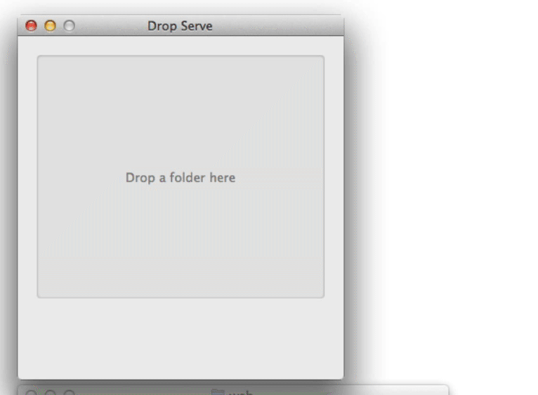

Drop Serve
==========

A GUI to easily start a static web server at a given folder location.

Drag a file or folder onto the drop area and:

1. A Python `SimpleHTTPServer` will start at that folder on
   `http://localhost:8000/`
2. The default web browser will open at the root URL

## Demo

## Install
Download the app from the [releases][1] page. Unzip it and drag it to the
`Applications` folder.

Drop Serve is designed to work on Mac OS X 10.6 and later.

## License
Copyright © 2020 Teddy Wing. Licensed under the GNU GPLv3+ (see the included
COPYING file).

[1]: https://github.com/teddywing/Drop-Serve/releases
